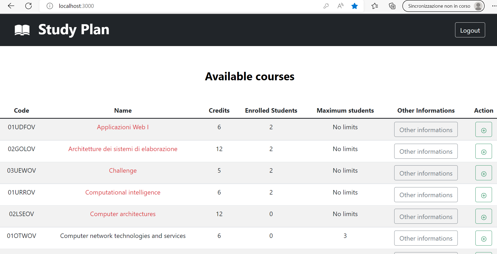
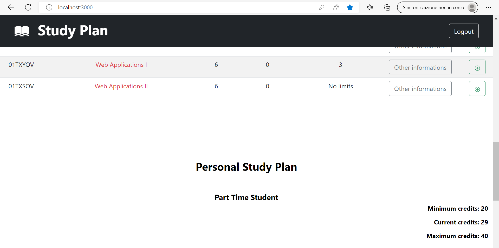
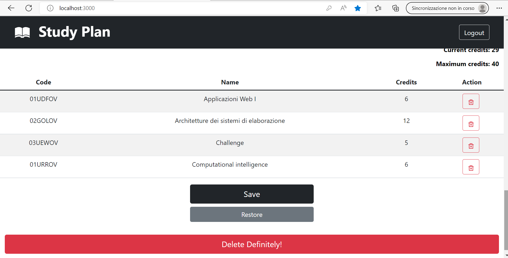

# Exam #1: "Study Plan"
## Student: s304684 Genna Giovanni

## React Client Application Routes

- Route `/`: This is the main page of the web site. When no one is logged in, the page shows all the available courses with their informations, ordered in alphabetical order (by course name). When someone is logged in and has not a personal study plan yet, they can choose the enrollment type ("Part Time" or "Full Time") and, then, the courses, from the list of all courses, that is always shown, respecting all the constraints; if they do not save the modifications, nothing is sent to the database. If a user is logged in and has a personal study plan saved in the database, it is possible do modify (add or remove), restore, save and delete parmanently the study plan, always respecting the constraints. When the user logs out, the page show only the list of all available courses again.
- Route `/login`: This page can be reached thanks to a button and here is possible to log in, with username and password, clicking the main button od the page. If the credentials are correct, the user is redirect to the page `/`, else an error message is shown and it is possible to try to log in again. There is a top left button and thanks to it is possible to be redirect in the `/` page, but without being logged in.

## API Server

- POST `/api/v1/user/login`
  - request: req.user
  - response: res.status(200).json({id:req.user.id, name:req.user.name, part_time:req.user.part_time})
- GET `/api/v1/user/me`
  - request: req.user, req.isAuthenticated()
  - response:
    - ok: res.status(200).json(req.user)
    - error: res.status(401).json({message:"Not authenticated"})
- DELETE `/api/v1/user/logout`
  - request: req.logout()
  - response: res.status(200).end()
- GET `/api/v1/courses`
  - request: None
  - response:
    - ok: res.status(200).json(result) (result is a list containing all the courses and all their informations, including info on incompatible courses and preparatory courses, ordered in alphabetical order (by course name))
    - error: res.status(500).json({ error: err });
- PATCH `/api/v1/user/me/enrollment`
  - request: req.user, req.isAuthenticated(), req.body.part_time
  - response: 
    - ok: res.status(201).end();
    - error: res.status(401).json({message:"Not authenticated"}), res.status(500).json({ error: err })
- GET `/api/v1/user/me/courses`
  - request: req.user, req.isAuthenticated()
  - response: 
    - ok: 
      -  res.status(200).json([]) (if no courses)
      -  res.status(200).json(value) (where value is the list of personal courses)
    - error: res.status(401).json({message:"Not authenticated"}), res.status(500).json({ error: err })
- DELETE `/api/v1/user/me/enrollment`
  - request: req.user, req.isAuthenticated()
  - response:
    - ok:  res.status(200).end();
    - error: res.status(401).json({message:"Not authenticated"}), res.status(500).json({ error: err })
- DELETE `/api/v1/user/me/courses`
  - request: req.user, req.isAuthenticated()
  - response:
    - ok:  res.status(200).end();
    - error: res.status(401).json({message:"Not authenticated"}), res.status(500).json({ error: err })
- PUT `/api/v1/courses`
  - request:  req.user, req.isAuthenticated(), req.body.list (list is a list containing the courses to update, specifically, in this API  the code and the number of enrolled students to set are used)
  - response:
    - ok:  res.status(200).end();
    - error: res.status(401).json({message:"Not authenticated"}), res.status(500).json({ error: err });
- POST `/api/v1/me/courses`
  - request:  req.user, req.isAuthenticated(), req.body.list(list is a list containing the courses to update, specifically, in this API  the code of the courses to link to the user is used)
  - response: 
    - ok: res.status(200).end();
    - error: res.status(401).json({message:"Not authenticated"}), res.status(500).json({ error: err });

## Database Tables

- Table `users` - contains:
  - id (INTEGER, Primary key)
  - email (TEXT)
  - name (TEXT)
  - hash (TEXT)
  - salt (TEXT)
  - part_time (BOOLEAN)

- Table `courses` - contains:
  - Code (VARCHAR(50), Primary key)
  - Name (VARCHAR(100))
  - Credits (INTEGER)
  - Max_students (INTEGER)
  - Preparatory_course (VARCHAR(50))
  - Enrolled_students (INTEGER)

- Table `user_course` - contains:
  
  - user_id (INTEGER, Foreign key(users))
  - course_code (VARCHAR(50), Foreign key(courses))
  

- Table `incompatible_courses` - contains:
  
  - code_1 (VARCHAR(50), Foreign key(courses))
  - code_2 (VARCHAR(50), Foreign key(courses))

## Main React Components

- `LoginForm` (in `AuthComponents.js`): this componet contains a form that allows to users to log in; in the form, there are two labels and their respective controls to insert username and password and a button to send the submit
- `LogoutButton` (in `AuthComponents.js`): this componet contains a button and, clicking on it, it is possible to trigger the logout 
- `CourseTable` (in `CourseTable.js`): if the user is not logged in, this componet shows only the table with all the courses (each course is inside a `CourseRow` (in `CourseRow.js`)); else, if the user is logged in and has not a study plan, in this component, above the table of all courses, a form, with a label, a select and a button, to set the enrollment type (Part Time or Full Time), appears (click the button after selecting the type does not send information to the server, but save the infomation locally in the client). If the user is logged in and has a study plan or has selected the enrollment type thanks to the aforementioned form, the form disappears and a new column is added to the table of all courses ('Action'); like before, each course is inside a `CourseRow` (in `CourseRow.js`). Under the table of all courses, there is a title ('Personal Study Plan') and other information on the minimum number of credits, the maximum number of credits and the current credits; below this informations, there is another  table that contains the exams chosen by the user (each course is inside a `PersonalCourseRow` (in `PersonalCourseRow.js`)). Finally, under this table, there is another componet: `CourseForm` (in `CourseForm.js` )
- `CourseRow` (in `CourseRow.js`): if the user is not logged in or has not selected an enrollment type yet, this componet contains a row, and, in each column, the informations about Code, Name, Credits, Enrolled Students, Maximum Students and, in the last column, another componet: `CourseDescription` (in `CourseDescription.js`), containing informations about Incompatible Courses and Preparatory Course.
If the user is logged in and has selected an enrollment type or has already a personal study plan, in addition to the aforementioned info, there is a button, and, clicking on it, it is possible to add the course to the table containing personal courses.
- `CourseForm` (in `CourseForm.js`): this component is shown only if the user is logged in and has a study plan or has selected the enrollment type. It contains a form with three buttons: 'Save', 'Restore', 'Delete Definitely!'. 'Save' allows to save in the database the information about the enrollment type and the selected courses, if and only if the constraints are respected (else an error message is shown). 'Restore' allows to restore the last information saved in the database: if a user does not have a study plan saved in the db, clicking on this button it is possible to choose again the enrollment type and then select the exams; else if a user has a study plan saved in the db and has added or removed courses from their list without saving, clinking on 'Restore' it is possible to go back to the list obtained from the db. 'Delete Definitely!' allows to delete from the db the study plan of the user, if any; else, i.e., if the user does not have a study plan saved in the db, the button is disabled because there would be nothing to delete definitely.
- `Topbar` (in `Topbar.js`): this component contains a navbar with a button inside which there is the title 'Study Plan'; by clicking on it, it is possible to navigate to `\`. If a user is logged in there is a top right button: `LogoutButton` (in `AuthComponents.js`); else there is another button and, thanks to it, it is possible to navigate to the page `/login`.

## Screenshot

## Users Credentials

USERNAME, PASSWORD:
- genna@webapp.com, password
- student@polytechnic.it, turin
- user@github.uk, hello
- franco@slack.it, swiss
- install@start.npm, modules
